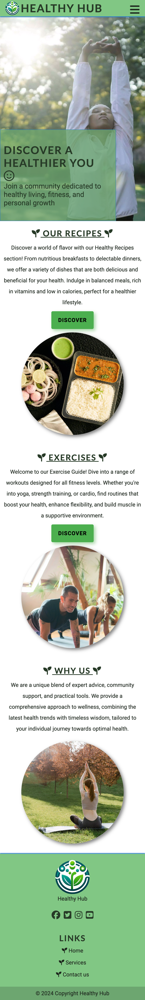
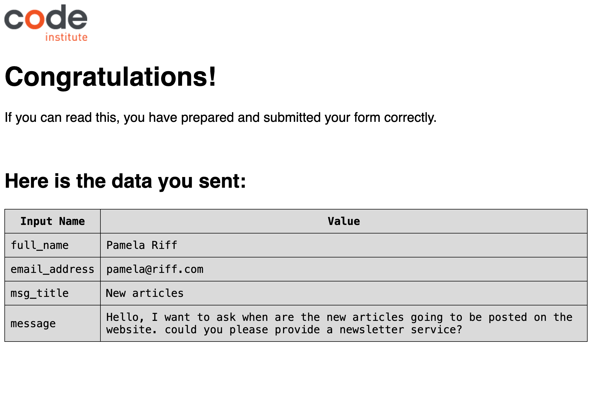
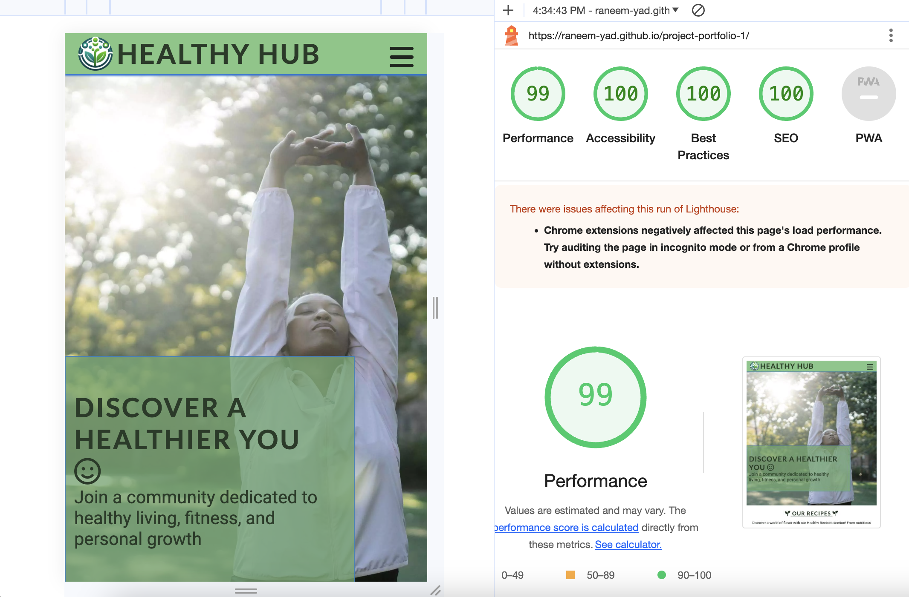
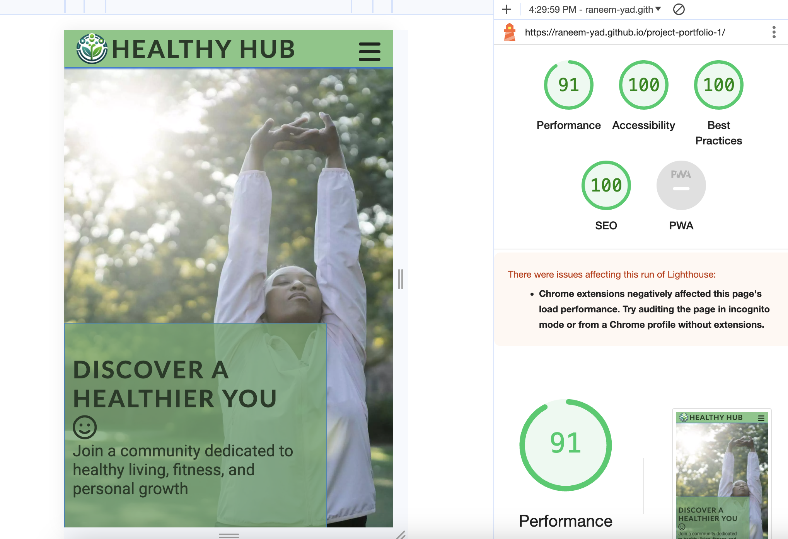

<h1 align="center"><a name="top">HEALTHY HUB</a></h1>

[View the live project here.](https://raneem-yad.github.io/project-portfolio-1/)

The story behind your website revolves around a passionate commitment to promoting a healthier lifestyle. It began with a vision to create a community-driven platform where individuals can discover and share knowledge about healthy habits. Your website serves as a beacon for those seeking guidance on nutritious recipes, effective exercise routines, and holistic wellness practices.

At its core, your website is more than just a collection of health tips; it's a movement towards a more informed and health-conscious society. It's a response to the growing need for accessible, reliable information on living a balanced life in today's fast-paced world. By combining expert advice with community experiences, our site offers a unique, engaging, and supportive environment for individuals at all stages of their health journey.

<h2 align="center"></h2>

## User Experience (UX)

*   ### User stories

    -   ####  Visitor Goals

        1. As a Visitor, I want to easily understand the main purpose of the site and learn more about how to be healthy.
        2. As a Visitor, I want to be able to easily navigate through the site to find content.
        3. As a visitor, I want to see the all articles that the website provides, So that I can educate myself more on healthy habits.
        4. As a visitor, I want to be able to contact the Website, So that can send them my feedback.

 

*   ### <a name="design">Design</a>
  
    -   #### Colour Scheme
        -   The three main colors used are :
            - Primary Color (#4CAF50): A vibrant shade of green, representing health and vitality.
            - Secondary Color(#2196F3): A calming shade of blue, symbolizing trust and reliability.
            - Accent Colors (#263b27): A darker shade of green, providing depth and contrast.

    -   #### Typography
        -   The website uses 'Lato' for headers and 'Roboto' for body text, with sans-serif as a fallback. These fonts are easy to read and complement the site's design without overshadowing other elements.

  
    -   #### Imagery
        -   The site features a large background hero image in the background (optimized for smaller devices) that embodies calmness and relaxation. It includes engaging text to capture the user's attention, clearly indicating the site's purpose.
        -   The website features a couple of additional pictures on different pages. The articles page contains mostly all the site's advice and what is the website and the contact Page contains a large background hero image to emphasize to the user the importance of this idea. All Pictures have the alt attribute to maximize accessibility.
  
    

   

*   ### <a name="wireframes">Wireframes</a>
    -   Home Page Wireframe - [View](https://github.com/raneem-yad/project-portfolio-1/blob/main/assets/images/readme/homepage-website.png)
       
    -   Wellbeing Page Wireframe - [View](https://github.com/raneem-yad/project-portfolio-1/blob/main/assets/images/readme/Recipes-website.png)

    -   Mobile Wireframe - [View](https://github.com/raneem-yad/project-portfolio-1/blob/main/assets/images/readme/homepage-phone.png)
     
    

 

## Features

###   Responsive on all device sizes

- The Page adjusts itself to 6 different sizes devices over 2600px wide (4k and Ultra wide Screens), 2600px to 1250px wide (most common Desktop/Laptop Display Resolutions), 1250px to 950px (to target tablet wide resolutions), 950px to 650px (bigger mobile resolutions), 650px-360px (most mobile resolutions) and 360px to around 280px (for very small resolution mobiles).

- For a view of the Page on different devices, the Picture at the [Top](#top) of the Page has a good overview. The following are 3 example resolution screenshots, emulating different sizes on Google Chrome/Mac OS.
    2.  Tablet Resolution
            <h2></h2> 
    3.  Phone Resolution
            <h2></h2> 

###   Interactive elements

- Feedback and Contact Us Forms: For collecting user feedback on various aspects of the website or the topics covered.

- Social Media Integration: Features that allow easy sharing of content to social media platforms, encouraging user interaction. Every Link has the rel="noopener" attribute for security reasons.

## Technologies Used

### Languages Used

-   [HTML5](https://en.wikipedia.org/wiki/HTML5)
-   [CSS3](https://en.wikipedia.org/wiki/Cascading_Style_Sheets)

### Frameworks, Libraries & Programs Used

1. [Google Fonts:](https://fonts.google.com/)
    - Google fonts were used to import the 'Titillium Web' font into the style.css file which is used on all pages throughout the project.
1. [Font Awesome:](https://fontawesome.com/)
    - Font Awesome was used on all pages throughout the website to add icons for aesthetic and UX purposes.
1. [Git](https://git-scm.com/)
    - Git was used for version control by utilizing the Gitpod terminal to commit to Git and Push to GitHub.
1. [GitHub:](https://github.com/)
    - GitHub is used to store the project's code after being pushed from Git.
1. [balsamiq:](https://balsamiq.com/)
    - Balsamiq was used to create the wireframes.

 

## Testing

### General Testing

1. The W3C Markup Validator and W3C CSS Validator Wellbeing were used to validate every page of the project to ensure there were no syntax errors in the project.
    - [W3C Markup Validator](https://validator.w3.org/#validate_by_input) - [Results](https://validator.w3.org/nu/?doc=https%3A%2F%2Franeem-yad.github.io%2Fproject-portfolio-1%2Findex.html)
    - [W3C CSS Validator](https://jigsaw.w3.org/css-validator/#validate_by_input) - [Results](https://jigsaw.w3.org/css-validator/validator?uri=https%3A%2F%2Franeem-yad.github.io%2Fproject-portfolio-1%2Findex.html&profile=css3svg&usermedium=all&warning=1&vextwarning=&lang=en)

3. Resolution and Scaling were tested with Google Dev tools down to the lowest width device (Galaxy Fold, 280px) to ensure the website works flawlessly on all resolutions 280px and above.

4. The Contact Us Page was tested with empty required First/Last Name and/or Email fields, entering no Email in the Email field, also with message title and with and without comments. The Form always gave the correct feedback when something was missing. When all required Information was provided, it then is posted to Code Institute's Form Dump Page.
        <h2></h2>

 

### Google Lighthouse Testing

1. Results
- Desktop:
  <h2></h2>
- Mobile:
  <h2></h2>

 

### Testing User Stories from User Experience (UX) Section

-   ####  Visitor Goals

    1. As a Visitor, I want to easily understand the main purpose of the site and learn more about how to be healthy.

        1. Upon entering the site, users are automatically greeted with a clean and easily readable navigation bar to go to the page of their choice. Underneath there is a Hero Image where a woman relaxed and enjoying the sunlight in a calming way with a captivating title "Discover a healthier you 😃", which should lead to the conclusion that is something related to health.
        2. The user can scroll down to learn more about the general site, and look up other media resources about it.

    2. As a Visitor, I want to be able to easily navigate throughout the site to find content.

        1. The site has been designed so each page can stand on its own and the visitor can freely choose to switch between each of them at any time. The Navigation points were named fittingly, so the visitor always knows what to expect on that site.
        2. The Navigation is fixed at the top and scrolls with the page. It is read- and useable at any time.
      
    3. As a Visitor, I want to see all the articles that the website provides, so that I can educate myself more on healthy habits.

        
        2. A 'Wellbeing' option is prominently displayed in the website's navigation bar. This section leads to a lot of articles divided by category.
        3. The web page will feature three sections, which are clearly labeled in each title section (recipes - exercises - wellness and lifestyle). each section will showcase a comprehensive list of all articles.
        4. Each article in the list will have a brief summary and an engaging thumbnail image to give users an idea of the content before clicking. This feature aids in helping the user find articles that are most relevant to their interests in health and wellness.
      
    4. As a Visitor, I want to be able to contact the Website, so that the website can get feedback.
        1. A 'Contact Us' option is prominently displayed in the website's navigation bar. This section leads to a simple and user-friendly contact form where visitors can submit their feedback, inquiries, or suggestions.
        2. The contact form will include fields for the visitor’s name, email, message title and message. Additionally, links to the website's social media were provided in the footer for alternative ways of communication.

 

### Further Testing

-   The Website was tested on Google Chrome,  Microsoft Edge, Firefox and Safari browsers.
-   The Website was viewed on a variety of devices such as Desktop, Laptop, iPad and different Android and iOS Phones.
-   Testing was done to ensure that all pages were linking correctly.
-   Friends were asked to review the site to point out any bugs and/or user experience issues.

 

### Known Bugs

-   On Desktop Devices with a very high resolution (above 2600px wide, e.g. a full screen window on a 4k or Ultra Wide Display), the Hero Image is no longer covering 100%. The page is then capped at 2600px and centered in the middle of the window.
-   On Desktop Devices with a very low resolution (below 280px wide), the consistency of the website can no longer be upheld. These kind of devices shouldn't be supported by modern operating systems anymore and should be extremely rare.

 

## Deployment

### GitHub Pages

The project was deployed to GitHub Pages using the following steps...

1. Log in to GitHub and locate the [GitHub Repository](https://github.com/raneem-yad/project-portfolio-1)
2. At the top of the Repository (not the top of the page), locate the "Settings" Button on the menu.
3. Scroll down the Settings page until you locate the "GitHub Pages" Section.
4. Under "Source", click the drop-down called "None" and select "Main Branch".
5. The page will automatically refresh.
6. Scroll back down through the page to locate the now published site [link](https://raneem-yad.github.io/project-portfolio-1/) in the "GitHub Pages" section.

### Forking the GitHub Repository

By forking the GitHub Repository we make a copy of the original repository on our GitHub account to view and/or make changes without affecting the original repository by using the following steps...

1. Log in to GitHub and locate the [GitHub Repository](https://github.com/raneem-yad/project-portfolio-1)
2. At the top of the Repository (not top of page) just above the "Settings" Button on the menu, locate the "Fork" Button.
3. You should now have a copy of the original repository in your GitHub account.

### Making a Local Clone

1. Log in to GitHub and locate the [GitHub Repository](https://github.com/raneem-yad/project-portfolio-1)
2. Under the repository name, click "Clone or download".
3. To clone the repository using HTTPS, under "Clone with HTTPS", copy the link.
4. Open Git Bash
5. Change the current working directory to the location where you want the cloned directory to be made.
6. Type `git clone`, and then paste the URL you copied in Step 3.
7. Press Enter. Your local clone will be created.

Click [Here](https://help.github.com/en/github/creating-cloning-and-archiving-repositories/cloning-a-repository#cloning-a-repository-to-github-desktop) to retrieve pictures for some of the buttons and more detailed explanations of the above process.

 

## Credits

### Code

-   The full-screen hero image code came originally from the [Love Running Project at Code Institute](https://github.com/Code-Institute-Solutions/love-running-2.0-sourcecode). The same goes for the Contact Us Page code. However, none of these  remain in their original form because they have been modified and styled differently in several aspects to fit the site's needs.

### Bug issues
- Stack Overflow for helping me to figure out how to put an overlay on an image[website](https://stackoverflow.com/)

### Content

-   All content was written by the developer, but they were modified and improved with helping of ChatGPT

### Images and Media
-   The website logo was also created by [chatGpt](https://chat.openai.com).
-   All images were taken from [pexel](https://www.pexels.com/).
-   Pexel Provides high-resolution images which affect the performance so I used a converter to convert them to Webp using [convertio](https://convertio.co/webp-converter/)
-   Card design inspired from [codepen](https://codepen.io/1bbnuuu/pen/mdoOKGO).
-   After creating the logo images I converted them to favicon using [Favicon converter](https://favicon.io/favicon-converter/)
 

### Readme

-   The Basic Structure of the Readme was taken from [Code Institute's Sample Readme](https://github.com/Code-Institute-Solutions/SampleREADME/blob/master/README.md).

### Acknowledgements

-   My Mentor for continuous helpful feedback.
-   My Peers in Code Institute's Slack channel for their feedback.
-   My spouse for supporting me the whole time.

