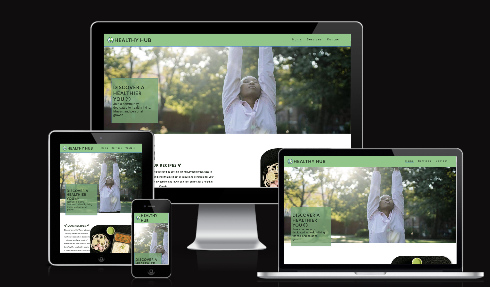

<h1 align="center"><a name="top">Healthy Hub</a></h1>

[View the live project here.](https://raneem-yad.github.io/project-portfolio-1/)

The story behind your website revolves around a passionate commitment to promoting a healthier lifestyle. It began with a vision to create a community-driven platform where individuals can discover and share knowledge about healthy habits. Your website serves as a beacon for those seeking guidance on nutritious recipes, effective exercise routines, and holistic wellness practices.

At its core, your website is more than just a collection of health tips; it's a movement towards a more informed and health-conscious society. It's a response to the growing need for accessible, reliable information on living a balanced life in today's fast-paced world. By combining expert advice with community experiences, our site offers a unique, engaging, and supportive environment for individuals at all stages of their health journey.

<h2 align="center"></h2>

## User Experience (UX)

*   ### Five Planes of UXD
    -   #### Strategy Plane
        Through this platform, I aspire to provide support, practical advice, and a community for those striving to navigate similar paths. My goal is to create a resource that not only informs but also inspires positive lifestyle changes.

 

*   ### <a name="design">Design</a>
  
    -   #### Colour Scheme
        -   The three main colors used are :
            - Primary Color (#4CAF50): A vibrant shade of green, representing health and vitality.
            - Secondary Color(#2196F3): A calming shade of blue, symbolizing trust and reliability.
            - Accent Colors (#263b27): A darker shade of green, providing depth and contrast.

    -   #### Typography
        -   The website uses 'Lato' for headers and 'Roboto' for body text, with sans-serif as a fallback. These fonts are easy to read and complement the site's design without overshadowing other elements.

  
    -   #### Imagery
        -   The site features a large background hero image in the background (optimized for smaller devices) that embodies calmness and relaxation. It includes engaging text to capture the user's attention, clearly indicating the site's purpose.
        -   The website features a couple of additional pictures on different pages. The articles page contains mostly all the site's advice and what is the website and the contact Page contains a large background hero image to emphasize to the user the importance of this idea. All Pictures have the alt attribute to maximize accessibility.
  
   

 
 ### User stories

    -   ####  Visitor Goals

        1. As a  Visitor, I want to easily understand the main purpose of the site and learn more about the story of Hachiko.
        2. As a  Visitor, I want to be able to easily navigate through the site to find content.
        3. As a visitor, I want to see the all articles that the website provides, So that I can educate myself more on healthy habits.
        4. As a visitor, I want to add my comments on articles, So that I can communicate with the Health Community. (extra feature in the future)
        5. As a visitor, I want to be able to contact the Website, So that can get in touch with the app.

 

## Table of Contents
1. [Project Goals](#project-goals)
- Business Goals
- User Goals
2. [User Experience](#user-experience)
- User Stories
- Design and Structure
- Wireframes
3. [Features](#features)
- Must Have (current features)
- Could Have
- Won't Have (for now)
4. [Technologies Used](#technologies-used)
5. [Testing](#testing)
- User stories tests
- Functionality
- HTML Validation
- CSS Validation
- JS Validation
- Python Validation
- Accessibility and Performance
- Browser Compatibility
- Device Compatibility
6. [Bugs](#bugs)
7. [Deployment](#deployment)
8. [Credits](#credits)
